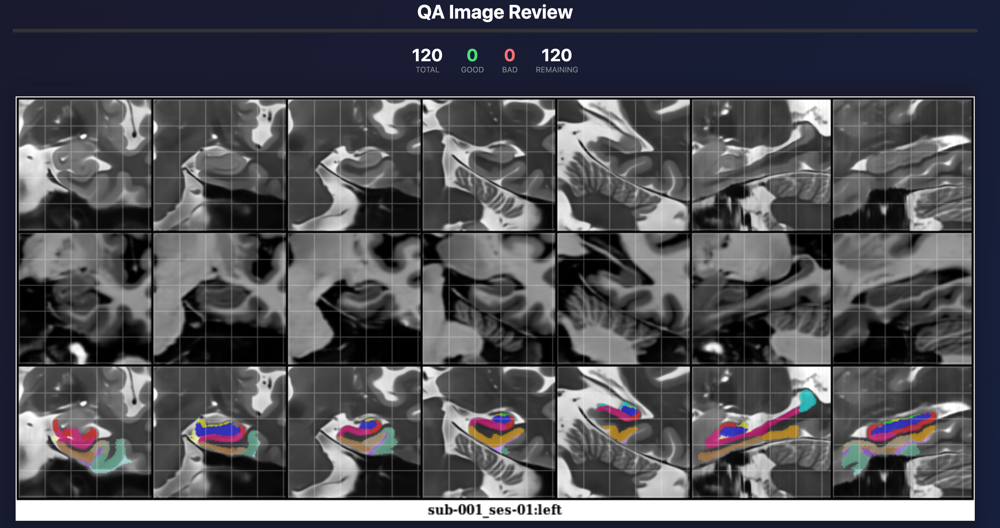

# QA Image Review App

A Tinder-style web app for quickly reviewing and rating QA images. Swipe right for good, left for bad.



## Features

- Swipe/drag cards left (bad) or right (good)
- Keyboard shortcuts: `←` bad, `→` good, `Z` undo
- Progress tracking with statistics
- Auto-saves results to CSV after each rating
- Undo functionality
- Export results anytime

## Installation

```bash
git clone https://github.com/jinghangli98/QA_app
cd QA_app
pip install flask
```

## Usage

1. Edit `IMAGE_PATTERN` in `app.py` to match your image paths:
   ```python
   IMAGE_PATTERN = "/path/to/your/images/**/*.png"
   ```

2. Run the app:
   ```bash
   python app.py
   ```

3. Open http://localhost:5000 in your browser

## Output

Results are saved to `qa_results.csv`:
```csv
image_path,rating,timestamp
/path/to/image1.png,good,2025-11-21T10:30:00
/path/to/image2.png,bad,2025-11-21T10:30:05
```

## Controls

| Action | Mouse | Keyboard |
|--------|-------|----------|
| Good   | Swipe right | `→` |
| Bad    | Swipe left  | `←` |
| Undo   | Click button | `Z` |
